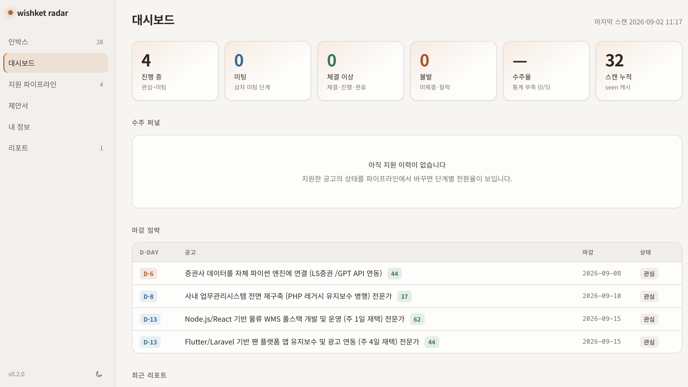

# wishket-radar

<p align="center">
  <a href="https://github.com/epicsagas/wishket-radar/releases"></a>
  <a href="https://github.com/epicsagas/wishket-radar/actions"></a>
  <a href="LICENSE"></a>
</p>

위시켓(wishket.com) 프로젝트를 검색·분석하고 내 기술 프로필과 매칭하는 멀티호스트 에이전트 플러그인 (Claude Code · Codex · Antigravity · Hermes).

- **Rust MCP 서버** (`wishket`): 위시켓 비공식 검색 API(리버스 엔지니어링) 호출, HTML/JSON-LD 파싱, 신규 diff 캐시, 결정론적 키워드 점수 계산
- **온보딩** `wishket-onboard`: 플러그인 설치 후 바이너리 점검부터 매칭 프로필까지 한 번에 설정
- **스킬**: 조회(`scan` · `search` · `scout` · `profile`)와 지원 흐름(`dashboard` · `apply` · `quote` · `pipeline` · `portfolio` · `deadline` · `feedback`). 문장 요청 시 자동 실행 (슬래시 커맨드 불필요)
- **서브에이전트** `wishket-analyst`: 프로젝트 단건 심층 분석 (적합도 A/B/C). scout가 호출한다. 출력은 한국어 5줄

## 대시보드



> "위시켓 웹 UI 띄워줘", "위시켓 대시보드", "위시켓 지원 현황 화면으로 보여줘" 등의 자연어로 에이전트 세션에서 띄울 수 있음

## 설치

### Grok Build (xAI)

```bash
grok plugin install epicsagas/wishket-radar --trust
```

Grok reads skills from `skills/` and agents from `agents/` at the plugin root. No extra configuration needed.

호스트에 플러그인을 설치한 뒤, 채팅에서 온보딩을 한 번 돌리면 MCP 바이너리 확인부터 매칭 프로필까지 끝난다. 프리빌트 바이너리는 온보딩이 못 찾거나 MCP만 따로 쓸 때의 선택 사항이다.

### Claude Code

```bash
claude plugin marketplace add epicsagas/wishket-radar
claude plugin install wishket-radar@wishket-radar -y
```

로컬 개발은 클론 디렉터리에서 `claude plugin marketplace add .` 후 동일하게 설치한다.

### Codex

```bash
codex plugin marketplace add epicsagas/wishket-radar
codex plugin add wishket-radar@wishket-radar
```

`.codex-plugin/plugin.json`과 `.codex-plugin/agents/*.toml`을 로드한다.

### agy (Antigravity)

```bash
agy plugin install https://github.com/epicsagas/wishket-radar
agy plugin enable wishket-radar
```

루트 `plugin.json`과 `mcp_config.json`을 인식한다. MCP 실행 파일은 `${CLAUDE_PLUGIN_ROOT}`(Claude), 현재 디렉터리(agy), PATH의 `wishket-mcp` 순으로 찾는다.

### Hermes

```bash
hermes plugins install https://github.com/epicsagas/wishket-radar
hermes plugins enable wishket-radar
```

루트 `plugin.yaml`과 `__init__.py`의 `register(ctx)`를 로드한다. skills_guard에 막히면 hermes 설정에서 `plugins.scan_on_install: false`로 둔다.

### 첫 설정 (온보딩)

플러그인을 켠 호스트 채팅에서 한 번 요청한다.

```text
위시켓 세팅해줘
```

`wishket-onboard`가 이어서 한다.

1. `wishket-mcp` 구동을 확인하고, 없으면 프리빌트(`install.sh` / `install.ps1`)를 깐다. `cargo`가 있어도 한방 설치가 먼저다. git 클론에서 한방 설치가 실패했을 때만 `cargo build --release`를 한다.
2. 주력 스택, 가중치, 역할, 근무 조건을 물어 `~/.wishket-radar/profile.yaml`을 만든다. 키워드 동의어(예: Rust → rust, 러스트, cargo, axum)도 채운다.
3. 원하면 `scan_new`로 베이스라인 스캔을 한 번 돌려 `~/.wishket-radar/state.db`에 현재 공고를 기록한다. 이후 스캔은 신규만 본다. 구버전(`state.json`·`applications.yaml`·`profile.yaml`)이 있으면 첫 기동에 자동 이관되고 원본은 `*.migrated`로 남는다.

이미 프로필이 있으면 요약을 보여 주고 재설정 여부만 확인한다. 프로필은 저장소에 커밋하지 않는다.

### 프리빌트 바이너리 (선택)

온보딩이 바이너리를 못 찾거나, MCP만 호스트 없이 쓰거나, Rust 툴체인 없이 미리 깔고 싶을 때:

```bash
# macOS / Linux
curl --proto '=https' --tlsv1.2 -LsSf \
  https://github.com/epicsagas/wishket-radar/releases/latest/download/install.sh | sh
```

```powershell
# Windows (PowerShell)
irm https://github.com/epicsagas/wishket-radar/releases/latest/download/install.ps1 | iex
```

래퍼(`scripts/wishket-mcp`, Windows는 `scripts/wishket-mcp.cmd`)는 로컬 릴리스 바이너리, PATH의 `wishket-mcp`, 한방 설치 순으로 찾고, git 클론에서만 마지막에 `cargo build`를 한다. `cargo install wishket-mcp --git https://github.com/epicsagas/wishket-radar`도 된다. Windows에서 MCP `command: sh`가 없으면 인스톨러가 PATH에 넣은 바이너리를 쓴다.

## 사용

별도 슬래시 명령 없이 문장으로 요청하면 된다. 권장 순서는 온보딩 → 프로필 확인 → 스캔 → 대시보드 인박스 분류 → 지원이다.

| 순서 | 스킬 | 트리거 예시 | 동작 |
|---|---|---|---|
| 1 | `wishket-onboard` | "위시켓 세팅해줘", "온보딩" | 바이너리 점검, 프로필 생성, 베이스라인 스캔 |
| 2 | `wishket-profile` | "프로필 보여줘", "rust 가중치 올려" | 매칭 프로필 조회/편집 (v0.4부터 `state.db`의 `settings.profile_yaml`가 정규 소스). 다음 스캔에 바로 반영 |
| 3 | `wishket-scan` | "위시켓 스캔", "새 프로젝트 있어?" | 마지막 스캔 이후 신규만 diff |
| 4 | `wishket-search` | "위시켓 검색", "flutter 프로젝트 있어?", "외주 찾아줘" | 임시 검색 (캐시 기록 없음) |
| 5 | `wishket-scout` | "위시켓 분석", "스카우트", "리포트 뽑아줘" | 신규 스캔 + 상위 후보 심층 분석 + 리포트 |
| 6 | `wishket-portfolio` | "이 프로젝트로 포트폴리오 써줘" | 위시켓 포트폴리오 폼 초안 (플레인 텍스트, 마크다운 금지) |
| 7 | `wishket-apply` | "이 공고 지원서 써줘" | 초안 `draft.md` + 위시켓 붙여넣기 `form.txt`. 견적은 `wishket-quote` |
| 8 | `wishket-pipeline` | "지원했어", "미팅 잡혔어", "지원 현황" | 위시켓 10단계 추적, 단계별 전환율·수주율 |
| 9 | `wishket-deadline` | "마감 캘린더에 넣어줘" | .ics 생성 → macOS/구글 캘린더 등록 |
| 10 | `wishket-feedback` | "수주율 높여줘" | 지원 결과 데이터로 프로필 가중치 보정 제안 |
| 11 | `wishket-dashboard` | "대시보드", "웹 UI 켜줘", "공고 분류할래" | 로컬 webui 실행 — 인박스 트리아지가 여기서 (아래 참고) |

온보딩을 건너뛰고 프로필만 손으로 만들 때는 예시를 복사한다.

```bash
mkdir -p ~/.wishket-radar
cp profile.example.yaml ~/.wishket-radar/profile.yaml
```

> v0.4부터 첫 대시보드 기동에서 `profile.yaml`이 `state.db`로 이관된다. 이관된
> 배포에서는 프로필 편집이 대시보드(내 정보)나 `wishket-profile` 스킬로만
> 반영된다 — 파일을 다시 만들어도 무시된다. 수동 롤백: `*.migrated`를 원래
> 이름으로 되돌리고 `state.db`를 삭제.

리포트는 `~/.wishket-radar/reports/`, seen 캐시는 `~/.wishket-radar/state.db`(SQLite, WAL)다.

## 대시보드 (webui)

같은 바이너리의 `dashboard` 서브커맨드가 `~/.wishket-radar/` 상태 전체를 브라우저에서 보여준다. 채팅 스킬과 같은 파일을 공유하므로 어느 쪽에서 편집해도 즉시 반영된다. 기본 진입 화면은 인박스다.

```bash
scripts/wishket-mcp dashboard          # 기본 8787 포트, 브라우저 자동 오픈
scripts/wishket-mcp dashboard --port 8790 --no-open
```

- 첫 기동 시 랜덤 토큰을 `~/.wishket-radar/dashboard-token`(0600)에 생성하고 접속 URL을 출력한다. 폰 등 LAN 기기 접속을 위해 0.0.0.0에 바인드되며, 모든 요청은 토큰 인증을 통과한다.
- 인박스에서 관심/스킵으로 분류한다. 관심만 파이프라인으로 간다. 공고 상세는 자동 조회하지 않는다(robots Crawl-delay). "상세 불러오기"를 누를 때만 위시켓에서 본문을 가져온다.
- 파이프라인은 위시켓 10단계(관심·지원·상담·미팅·체결·진행 중·완료·미체결·탈락·철회)와 전환율·수주율을 보여 준다. 상세 `#/pipeline/{id}`에서 단계·메모·다음 할 일을 편집한다.
- 내 정보: 매칭 프로필(구조화 폼 + YAML), 포트폴리오, AI 설정. 포트폴리오는 공고와 무관한 재사용 자산이라 제안서와 분리한다.
- AI 평가 (v0.5, BYOK): 내 정보 → "AI 설정"에서 자신의 LLM API 키(Anthropic/OpenAI/호환 엔드포인트)를 넣으면 인박스·파이프라인 상세의 "AI 평가" 버튼으로 분석가와 동일 포맷(등급 5줄)의 평가를 즉시 돌릴 수 있다. 키는 `state.db`에만 저장되고 응답으로 재노출되지 않으며(마스킹), 브라우저 JS는 키를 모른 채 서버 프록시(`/api/ai/chat`, SSE)를 통해 공급자와 대화한다.
- AI 대화 (v0.6): 우하단 플로팅 버튼으로 어느 화면에서든 질문하고, 사이드바 "AI 대화" `#/chats`에서 대화 목록·이어하기·삭제(2단 확인)를 관리한다. 공고 상세의 "AI 대화"로 시작하면 본문·조건·매칭이 맥락으로 주입되고 목록에 공고 제목으로 태그된다. 대화·토큰 누적은 SQLite에 영속되며 채팅 헤더에서 볼 수 있다.
- 제안서는 `proposals/<공고ID>/` 아래 공고 단위. 로컬 검토용 `draft.md`(마크다운)와 위시켓 폼 붙여넣기용 `form.txt`(플레인 텍스트, `#`/`**`/표 금지) 두 파일만 쓴다.
- 라이트/다크 테마는 사이드바 하단, 버전과 같은 줄 맨 오른쪽 아이콘으로 전환한다. 선택은 브라우저에 남는다.
- 스카우트 리포트의 적합도 판정(A/B/C)·주의점·제안 방향이 인박스 카드에 붙는다.
- 편집 저장은 원자 쓰기(tmp+rename) 후 이전 본문을 `.bak`으로 1세대 보관한다(파일 기반 산출물: 리포트·제안서·포트폴리오). 프로필은 `state.db` settings에 저장되며 폼 저장 시 스키마 검증을 거친다.
- 저장소는 SQLite(`state.db`, WAL 모드, 0600)다. 대시보드 3초 폴링과 쓰기가 겹쳐도 읽기가 막히지 않고, `backups/`에 7일 간격 `VACUUM INTO` 스냅샷 4세대를 유지한다. `reset_cache`는 seen 캐시·마지막 스캔 시각만 지운다(파이프라인·프로필 보존).

## MCP 도구

| 도구 | 설명 |
|---|---|
| `scan_new` | 신규 diff 스캔 (기본 3페이지 30건, 요청 간 5초) |
| `search_projects` | 순수 검색 (category/form_factors/keyword/page/raw) |
| `get_project` | 상세 조회 (JSON-LD 전체 설명 포함) |
| `list_filters` | 필터 키 문서 (검증/미검증 구분) |
| `reset_cache` | seen 캐시 초기화 |

## 동작 원리

검색 필터는 `k=v&k=v` 문자열을 LZString(base64)으로 압축해 `?d=` 파라미터로 전송하고, `X-Requested-With` 헤더와 함께 호출하면 `{result, count}` JSON을 반환한다 (`server/src/wishket.rs` 참조). 상세 페이지는 schema.org JobPosting JSON-LD에서 전체 설명을 추출한다.

매칭은 2단계로 동작한다. 서버가 `WISHKET_PROFILE`(기본 `~/.wishket-radar/profile.yaml`) 키워드로 결정론적 점수(0~100)를 계산하고, LLM(analyst)이 공고 본문을 근거로 적합도 A/B/C를 판정한다.

## 디렉터리 구조 및 상태

```
~/.wishket-radar/
├── state.db            # seen 캐시 + 인박스 트리아지 + 파이프라인 + 프로필 (SQLite WAL, 0600)
├── backups/            # 주간 VACUUM INTO 스냅샷 (4세대)
├── *.migrated          # 구 state.json/applications.yaml/profile.yaml (이관 원본)
├── dashboard-token     # webui 접근 토큰 (자동 생성, 0600)
├── reports/            # 스캔 리포트 (한국어 markdown)
├── proposals/<공고ID>/ # draft.md(검토) + form.txt(위시켓 붙여넣기)
├── portfolios/         # 포트폴리오 폼 초안 (플레인 텍스트)
└── deadlines/          # 마감 .ics
```

## 개발

```bash
cargo test --manifest-path server/Cargo.toml    # LZString 왕복·파서 단위 테스트
npm --prefix webui ci && npm --prefix webui run build && npm --prefix webui run check
```

프론트만 고칠 때는 API 서버와 Vite를 같이 켠다. Vite는 `/api`를 `127.0.0.1:8787`로 프록시한다.

```bash
scripts/wishket-mcp dashboard --no-open
npm --prefix webui run dev    # http://localhost:5173
```

`wishket-mcp dashboard`는 `webui/dist`를 바이너리에 임베드한다. 릴리스·로컬 임베드 빌드 전에 `npm --prefix webui run build`가 필요하다. dist가 없으면 `server/build.rs`가 스텁 `index.html`을 써서 컴파일만 통과시킨다.

위시켓 마크업이 바뀌면 `server/src/wishket.rs`의 셀렉터와 테스트 픽스처를 함께 갱신한다.

## 주의 (법적 고지 포함, 사용 전 필독)

- **위시켓 서비스약관 제10조**는 "프로젝트의 정보 및 파트너의 정보를 수집하기 위해 크롤링을 하는 행위"를 회원 의무 위반으로 금지하고, 같은 조에서 리버스 엔지니어링 금지를 명시한다. 제재는 서면경고, 이용 제한, 영구 정지 순으로 강화되며, 약관은 비회원을 이유로 한 면책 주장도 배제한다. 위시켓 회원(파트너) 계정으로 사용하면 계정 제재 위험이 있다. **본 플러그인은 개인적 검토 목적의 소량 조회 용도이며, 사용 책임은 이용자에게 있다.**
- robots.txt는 `/project/` 크롤링을 허용(사이트맵 제공)하되 `Crawl-delay: 5`를 요구한다. 서버는 검색·상세를 포함한 모든 HTTP 요청 사이에 5초를 둔다.
- 요청 UA는 `wishket-radar/<버전> (+repo)`로 정체성을 밝힌다. 로그인·인증 우회 없이 공개 페이지만 조회하며, 회원 전용 영역(`/partners/`, `/media/` 등 robots.txt 비허용 경로)은 호출하지 않는다.
- 비공식 API 기반이므로 위시켓 측 변경에 깨질 수 있다 (SSR 폴백 내장).
- 과도한 스캔 금지. 수집 데이터는 seen 캐시(90일)와 로컬 리포트뿐이며 재배포를 엄격히 금한다.

## 기여 (Contributing)

기여 가이드 및 개발 환경 설정은 [CONTRIBUTING.md](CONTRIBUTING.md)를 참고해 주세요. 버그 제보와 기능 제안은 이슈를 통해 환영합니다.

## 라이선스 (License)

[Apache-2.0](LICENSE) © 2026 epicsagas
