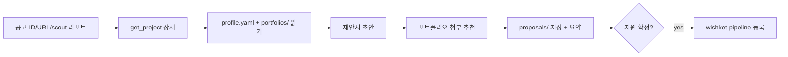

# wishket-apply — 위시켓 지원서·제안서 작성

## 흐름

## 1단계: 공고 상세 확보

- 사용자가 ID/URL을 주면 `get_project`로 상세 조회.
- scout 리포트 파일 경로를 주면 그 파일에서 ID 추출 후 `get_project`.
- 없으면 `search_projects`로 공고를 찾아 사용자에게 확인.
- `~/.wishket-radar/state.json`의 해당 `seen` 항목에 `description`이 캐시돼 있으면(대시보드에서 상세를 불러온 경우) 그걸 먼저 쓴다 — 재조회는 robots Crawl-delay 5초를 소모한다.
- 제안서를 쓴다는 건 이미 관심 단계라는 뜻이다. `triage`가 없으면 wishket-pipeline으로 "관심" 등록을 먼저 제안한다.

## 2단계: 재료 수집

- `~/.wishket-radar/profile.yaml` (`WISHKET_PROFILE` 오버라이드 우선): 스택, roles, notes.
- `~/.wishket-radar/portfolios/`의 기존 초안들: 각 파일 상단부(제목·기술·핵심 기능)만 훑어 공고와의 기술 중복도 파악.
- 사용자가 요구사항 문서·레퍼런스를 추가로 주면 wishket-portfolio의 문서 추출 방식(PDF=Read, PPTX/DOCX/XLSX=unzip) 재활용.

## 3단계: 제안서 작성

**출력은 일반 텍스트(마크다운 아님).** 위시켓 지원서 본문은 붙여넣기 형식이므로 `#`, `**`, 표 문법 금지. 목록은 `-` 또는 `1)`만.

사용자가 실제 지원 폼을 붙여넣어 주면 그 폼 필드에 맞춘다. 없으면 아래 표준 구성:

1. 프로젝트 이해 (공고의 핵심 요구를 2-3문장으로 재진술. 원문 복붙 금지)
2. 접근 전략 (단계별 수행 계획, 기술 선택과 이유)
3. 유사 경험 (프로필·포트폴리오에서 공고 요구와 직접 연결되는 것만. 정량 지표 우선)
4. 일정·인력 (예상 기간, 투입 구성. 불확실하면 범위로)
5. 제안 금액 (근거 필요. wishket-quote 결과가 있으면 인용, 없으면 "금액 협의"로 두고 wishket-quote 안내)

작성 규칙:

- 매칭된 스킬 키워드(profile.yaml keywords와 공고 설명의 교집합)를 자연스럽게 녹인다. 키워드 나열 금지.
- 과장·허위 경험 금지. 프로필/포트폴리오에 없는 경험은 쓰지 않는다.
- 이메일·전화·외부 연락 수단 금지 (포트폴리오 폼과 동일 규칙).
- 고객사 정보는 get_project 결과에 있는 것만 사용.

## 4단계: 포트폴리오 첨부 추천

- 기술 중복도 순으로 상위 3개 제안, 각각 "왜 이 공고에 맞는가" 한 줄.
- portfolios/가 비어 있으면 wishket-portfolio 안내.
- 첨부 시 포트폴리오 노출 순서(위시켓은 첫 포트폴리오가 대표 노출)까지 제안.

## 5단계: 저장·등록

- 저장: **`~/.wishket-radar/proposals/<공고ID>/YYYY-MM-DD-<용도>.<확장자>`** (디렉터리 없으면 생성).
  - **공고 ID는 디렉터리 이름으로 표현한다.** 대시보드는 디렉터리로 소유자를 판별하며 파일명은 해석하지 않는다. 루트에 바로 두면 "기타"로 분류돼 공고와 연결되지 않는다.
  - 용도: `draft`(검토용 초안), `form`(위시켓 폼 붙여넣기용 일반 텍스트), `submit`(제출본).
  - 확장자: 초안·제출본은 `.md`(대시보드가 렌더), 폼 붙여넣기용은 `.txt`.
  - 예) `proposals/158080/2026-09-02-draft.md`, `proposals/158080/2026-09-02-form.txt`
  - 파일명에 공고 ID를 중복해 넣지 않는다 — 디렉터리가 이미 갖고 있다.
- 채팅에는 요약: 제안 전략 한 줄, 매칭 강점, 제안 금액 상태(있음/협의), 첨부 추천 목록.
- 사용자가 지원 확정하면 wishket-pipeline으로 단계를 "지원"으로 올린다(applications.yaml 승격). 금액·기간·마감을 물어 같이 기록.
- 초안만 쓰고 제출을 미루면 "관심"에 두고 `next_action`에 "제안서 초안 완료 — 제출 여부 결정"을 적는다.

## 주의

- 제안 금액은 사용자 승인 전에 확정 값으로 쓰지 않는다. 임시 표기 또는 wishket-quote 호출.
- 공고 마감이 임박(3일 이내)하면 응답 상단에 마감일 경고.
