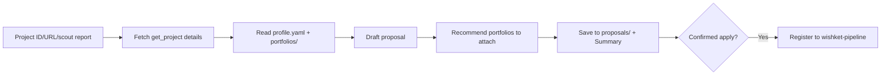

# wishket-apply — Wishket Application & Proposal Drafting

## Flow

## Step 1: Obtain Project Details

- If the user provides a project ID or URL, retrieve details via `get_project`.
- If given a scout report file, extract the project ID and call `get_project`.
- If missing, search using `search_projects` and confirm with the user.
- If `description` is already cached in the `state.db` cache under `seen[<id>]`, reuse it first to avoid the 5-second `Crawl-delay`.
- Writing a proposal means the project is already at 관심. If `triage` is missing, suggest marking it Interested in `wishket-pipeline` first.

## Step 2: Gather Materials

- `~/.wishket-radar/profile.yaml` (respect `WISHKET_PROFILE` override): tech stack, roles, notes.
- Existing drafts in `~/.wishket-radar/portfolios/`: scan file headers (title, tech stack, core features) to determine relevance.
- If the user provides extra requirement documents, use the extraction pattern from `wishket-portfolio` (PDF=Read, PPTX/DOCX/XLSX=unzip).

## Step 3: Draft Proposal

Always produce **exactly two files**. Do not write a third `submit` copy.

| File | Role | Format |
|---|---|---|
| `draft.md` | Local review in the dashboard | Markdown allowed (`#`, `**`, tables) |
| `form.txt` | Paste into the Wishket application form | **Plain text only** |

Write `draft.md` first. Derive `form.txt` from it by flattening headings, bold, and tables into sentences and `-` / `1)` lists. Wishket's form does not render markdown, so `form.txt` must not contain `#`, `**`, backticks, or markdown tables.

If the user provides an exact application form schema, `form.txt` follows that field layout. `draft.md` may keep a richer review structure.

Standard sections (both files):

1. **Project Understanding** (Restate core requirements in 2-3 sentences. Never copy-paste raw text).
2. **Approach & Strategy** (Phase-by-phase execution plan, technology choices, and rationale).
3. **Relevant Experience** (Directly relevant items from profile/portfolios with quantitative metrics where possible).
4. **Schedule & Staffing** (Estimated duration and team composition; provide ranges if uncertain).
5. **Proposed Budget** (State rationale. Reference `wishket-quote` results if available; otherwise state "금액 협의" and suggest `wishket-quote`).

### Drafting Rules:
- Naturally integrate matched skill keywords (intersection of `profile.yaml` keywords and project description). Avoid keyword stuffing.
- Do not fabricate or exaggerate experience. Only include verifiable skills/projects.
- Prohibit external contact info (email, phone, websites). Same rule as the portfolio form.
- Use client information only as provided in `get_project`.

## Step 4: Recommend Portfolio Attachments

- Propose top 3 relevant portfolios by tech overlap, with a one-line rationale for each.
- If `portfolios/` is empty, recommend running `wishket-portfolio`.
- Recommend the display order (Wishket displays the first portfolio as primary).

## Step 5: Save & Register

- File location: **`~/.wishket-radar/proposals/<PROJECT_ID>/YYYY-MM-DD-<usage>.<ext>`** (create directory if missing).
  - **Directory name MUST be the project ID.** The dashboard associates proposals by directory name. Placing files at root classifies them as "Other" and breaks project linkage.
  - Usages: `draft` and `form` only. Never write `submit.md`.
  - Extensions: `draft.md` (dashboard markdown), `form.txt` (Wishket paste).
  - Examples: `proposals/158080/2026-09-02-draft.md`, `proposals/158080/2026-09-02-form.txt`.
  - Do not duplicate the project ID in the filename.
- Chat summary: 1-line strategy, key matching strengths, budget status, recommended portfolio attachments.
- When application is confirmed: Promote stage to "지원" in `wishket-pipeline` (pipeline store in `state.db`), recording budget, duration, and deadline.
- If drafting is complete but submission is deferred: Keep in "관심" and set `next_action` to "제안서 초안 완료 — 제출 여부 결정".

## Caution
- Do not finalize budget numbers without user confirmation; use placeholder or call `wishket-quote`.
- If the project deadline is within 3 days, place an urgent deadline warning at the top of the chat response.
