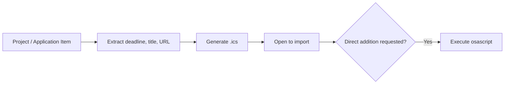

# wishket-deadline — Register Project Deadlines to Calendar

## Flow



## Step 1: Extract Information

- For project ID/URL, fetch deadline and title via `get_project`.
- For pipeline entries in `state.db` (via `wishket-pipeline`), use `deadline`, `title`, and `url` fields.
- If specific time is absent, create an all-day event.
- If the deadline has already passed, notify the user without creating an event.

## Step 2: Generate .ics (Default Path)

Write to `~/.wishket-radar/deadlines/<id>.ics` (create directory if missing). Compatible with macOS Calendar and Google Calendar:

```bash
printf '%s\r\n' \
  "BEGIN:VCALENDAR" \
  "VERSION:2.0" \
  "PRODID:-//wishket-radar//deadline//KO" \
  "CALSCALE:GREGORIAN" \
  "BEGIN:VEVENT" \
  "UID:wishket-<id>@wishket-radar" \
  "DTSTAMP:$(date -u +%Y%m%dT%H%M%SZ)" \
  "DTSTART;VALUE=DATE:YYYYMMDD" \
  "DTEND;VALUE=DATE:YYYYMMDD" \
  "SUMMARY:[위시켓 마감] <Title>" \
  "DESCRIPTION:<Project URL>" \
  "BEGIN:VALARM" \
  "TRIGGER:-P1D" \
  "ACTION:DISPLAY" \
  "DESCRIPTION:마감 1일 전" \
  "END:VALARM" \
  "END:VEVENT" \
  "END:VCALENDAR" \
  > ~/.wishket-radar/deadlines/<id>.ics
```

### Formatting Rules:
- RFC 5545 compliant: CRLF line endings, `DTEND` as day after deadline for all-day events (exclusive end).
- Fixed UID `wishket-<id>@wishket-radar` ensures updates overwrite the same event.
- Default reminder: 1 day prior (`-P1D`). Add 3-day reminder (`-P3D`) if requested.

## Step 3: Registration

- Default: `open ~/.wishket-radar/deadlines/<id>.ics` opens the native macOS Calendar import prompt.
- Google Calendar: Instruct user to import the file under Calendar Settings > Import & Export, or use `gcal` CLI if present.
- Direct AppleScript import (without clicking import):

```bash
osascript - <<'EOF'
tell application "Calendar"
  make new event at end of events of calendar "<CalendarName>" with properties {summary:"[위시켓 마감] <Title>", start date:date "<YYYY-MM-DD HH:MM:SS>", end date:date "<YYYY-MM-DD HH:MM:SS>", allday event:true, description:"<URL>"}
end tell
EOF
```

List available calendars via `osascript -e 'tell application "Calendar" to get name of calendars'` and let the user pick one. Date-string parsing varies by locale; if AppleScript fails, fall back to the `.ics` path.

## Step 4: Completion Report

- Report registered event summary (title, deadline, reminder time) and file path.
- If called from `wishket-pipeline`, append "캘린더 등록 완료" note to the application item.
