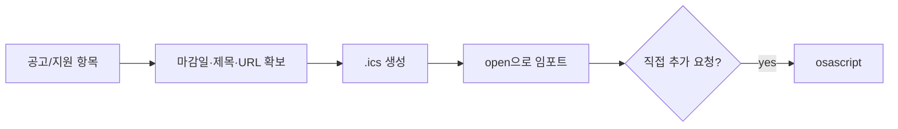

# wishket-deadline — 마감 캘린더 등록

## 흐름



## 1단계: 정보 확보

- 공고 ID/URL이면 `get_project`에서 마감일·제목 확보.
- applications.yaml 항목(wishket-pipeline 경유)이면 `deadline`, `title`, `url` 필드 사용.
- 마감 시각 정보가 없으면 마감일 자체를 종일 이벤트로.
- 마감일이 이미 지난 경우 등록하지 않고 안내만.

## 2단계: .ics 생성 (기본 경로)

`~/.wishket-radar/deadlines/`에 생성 (디렉터리 없으면 mkdir). macOS 캘린더와 구글 캘린더(웹 임포트) 양쪽에서 쓸 수 있는 공통 포맷이다.

```bash
printf '%s\r\n' \
  "BEGIN:VCALENDAR" \
  "VERSION:2.0" \
  "PRODID:-//wishket-radar//deadline//KO" \
  "CALSCALE:GREGORIAN" \
  "BEGIN:VEVENT" \
  "UID:wishket-<id>@wishket-radar" \
  "DTSTAMP:$(date -u +%Y%m%dT%H%M%SZ)" \
  "DTSTART;VALUE=DATE:YYYYMMDD" \
  "DTEND;VALUE=DATE:YYYYMMDD" \
  "SUMMARY:[위시켓 마감] <제목>" \
  "DESCRIPTION:<공고 URL>" \
  "BEGIN:VALARM" \
  "TRIGGER:-P1D" \
  "ACTION:DISPLAY" \
  "DESCRIPTION:마감 1일 전" \
  "END:VALARM" \
  "END:VEVENT" \
  "END:VCALENDAR" \
  > ~/.wishket-radar/deadlines/<id>.ics
```

규칙:

- RFC 5545 준수: CRLF 줄바꿈, 종일 이벤트는 DTEND를 마감 다음날로( exclusive end).
- UID를 `wishket-<id>@wishket-radar`로 고정하면 재생성해도 같은 이벤트로 갱신된다.
- SUMMARY에는 제목을 짧게. DESCRIPTION에 URL.
- 알림은 마감 1일 전 기본. 마감 3일 전 추가를 원하면 VALARM 블록(`TRIGGER:-P3D`) 하나 더.

## 3단계: 등록

- 기본: `open ~/.wishket-radar/deadlines/<id>.ics` — macOS 캘린더 임포트 창이 열린다. 사용자가 캘린더 선택해 확인.
- 구글 캘린더 사용자: calendar.google.com의 설정 > 캘린더 가져오기에 같은 파일을 올리도록 안내. `gcal` CLI가 설치되어 있으면 그걸 써도 됨.
- AppleScript 직접 추가(임포트 클릭 없이)를 원하면:

```bash
osascript - <<'EOF'
tell application "Calendar"
  make new event at end of events of calendar "<캘린더명>" with properties {summary:"[위시켓 마감] <제목>", start date:date "<YYYY-MM-DD HH:MM:SS>", end date:date "<YYYY-MM-DD HH:MM:SS>", allday event:true, description:"<URL>"}
end tell
EOF
```

캘린더명은 먼저 `osascript -e 'tell application "Calendar" to get name of calendars'`로 목록을 보여주고 사용자가 고르게 한다. 로케일에 따라 date 문자열 파싱이 달라질 수 있으니 실패 시 .ics 경로로 안내한다.

## 4단계: 완료 보고

- 등록된 이벤트 요약(제목, 마감일, 알림 시점)과 파일 경로 전달.
- wishket-pipeline 항목에서 온 경우 note에 "캘린더 등록 완료" 한 줄 추가.
