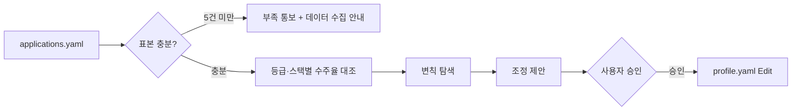

# wishket-feedback — 수주 결과 기반 프로필 보정

## 흐름

## 1단계: 데이터 확보

- `~/.wishket-radar/applications.yaml` 읽기. 종결(체결 이상/미체결/탈락) 항목이 5건 미만이면 분석하지 않고 종결. "지원 결과를 계속 기록하면 패턴이 보인다"고 안내하고 종료.
- 종결 항목만 분석 대상. 진행 중(관심/지원/상담/미팅)은 제외.
- 단계별 전환율을 먼저 본다. 최종 수주율만 보면 어느 구간이 문제인지 안 보인다.

## 2단계: 변칙 탐색

등급(scout 판정)과 실제 결과의 괴리를 찾는다:

- **A등급 체결율 < B등급 체결율**: 매칭 스코어가 실제와 어긋남. A등급 공고의 공통 키워드 중 프로필에 높은 weight를 준 키워드가 오탐일 가능성. 해당 키워드 weight 하향 또는 키워드 분리 제안.
- **특정 스택 공고만 연속 거절**: 그 스택 경험이 약하거나 시장 단가·경쟁 문제. 프로필에서 weight 하향 또는 roles에서 제외 제안.
- **특정 키워드 공고만 연속 수주**: 강점. weight 상향 또는 관련 동의어 키워드 추가 제안.
- **지원은 하는데 상담으로 안 넘어감**: 위시켓 매니저 선발에서 걸림. 제안 금액·기간이 비현실적이거나 제안서가 약함. wishket-apply·wishket-quote 점검. 프로필 조정 아님.
- **미팅까지 가고 체결이 안 됨**: 매칭은 맞지만 조건 협상 문제. 견적 기준 재검토(wishket-quote). 프로필 조정 아님.

## 3단계: 제안 적용

- 조정안은 항목별로: 현재 값, 제안 값, 근거(데이터에서 몇 건의 어떤 패턴), 예상 효과 한 줄.
- 근거 없는 조정 금지. 표본이 적은 패턴(2건 이하)은 "경향"으로만 언급하고 조정하지 않는다.
- 사용자가 승인한 항목만 Edit으로 profile.yaml 반영. 자동 반영 금지.
- 반영 후 "다음 스캔부터 즉시 적용됨(서버 재시작 불필요)" 안내.

## 주의

- 원인이 프로필 밖(제안 금액, 시기, 경쟁)일 수 있음을 항상 언급. 매칭 로직 탓으로 단정 금지.
- profile.yaml 상단 주석(출처)은 보존한다.
