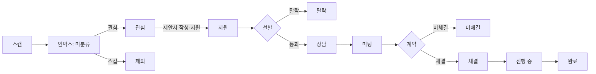

# wishket-pipeline — 지원 파이프라인 추적

## 데이터

`~/.wishket-radar/applications.yaml` (파일이 정규 소스. 없으면 생성):

```yaml
applications:
  - id: "12345"            # 위시켓 공고 ID
    title: 공고 제목
    url: https://wishket.com/project/12345
    grade: A               # 지원 시점 scout 판정
    quote_manwon: 3000     # 제안 금액(만원). 협의면 null
    applied_at: 2026-09-02
    deadline: 2026-09-10   # 공고 마감(있으면)
    status: 지원           # 아래 10단계 중 하나
    status_at: 2026-09-02  # 마지막 상태 변경일
    next_action: Follow-up 메시지 검토   # 다음 할 일 (없으면 null)
    note: |
      자유 메모. 면담 내용, 피드백 등.
```

## 전체 흐름



스캔 결과는 `state.json`의 `seen`에 쌓이고, `triage`가 없으면 인박스(미분류)에 남는다. 대시보드 인박스에서 관심/스킵을 고르면 `triage`가 기록되고, **관심 항목만** 파이프라인에 나타난다. 지원 이후 단계로 바꾸는 순간 `applications.yaml`로 승격된다.

## 위시켓 실제 수주 단계

| 상태 | 위시켓 공식 단계 | 의미 |
|---|---|---|
| 관심 | (지원 전) | 인박스에서 관심 표시, 아직 지원 안 함 |
| 지원 | 1. 지원 | 금액·기간을 제안해 지원서 제출 |
| 상담 | 2. 위시켓 상담 | 매니저가 클라이언트와 상담해 지원자 선발 중 |
| 미팅 | 3. 미팅 | 클라이언트·파트너·매니저 삼자 미팅 |
| 체결 | 4. 체결 | 최종 계약 확정 |
| 진행 중 | 5. 진행 중 | 클라이언트 대금 선예치 후 개발 착수 |
| 완료 | 6. 완료 | 승인 후 위시켓이 대금 지급, 종료 |
| 미체결 | 4. 미체결 | 조건이 맞지 않아 취소 |
| 탈락 | 2~3에서 종료 | 선발되지 않음 |
| 철회 | — | 본인이 지원 포기 |

수주율 = 체결 이상(체결·진행 중·완료) / (체결 이상 + 미체결 + 탈락). 철회는 분모에서 제외한다.

단계별 전환율(지원 → 상담 → 미팅 → 체결 → 완료)이 어디서 새는지 보여주므로, 개선점을 찾을 때는 최종 수주율보다 구간 전환율을 먼저 본다.

규칙:

- 인박스 분류는 대시보드(wishket-dashboard)에서 하는 게 빠르다. 채팅으로 "이거 관심" 하면 `state.json`의 해당 `seen` 항목에 `triage: interested`, `triaged_at`을 넣는다.
- 등록은 wishket-apply 경유가 보통이지만 사용자가 직접 "지원했어"라고 말해도 등록한다. 이때 공고 ID/URL/제목을 확인해 받는다(get_project로 보강 가능).
- 상태 전환은 사용자 발언에서 감지해 갱신한다: "지원했어"→지원, "위시켓에서 연락 왔어"→상담, "미팅 잡혔어"→미팅, "계약했어"→체결, "착수했어"→진행 중, "끝났어/정산됐어"→완료, "떨어졌어"→탈락, "조건 안 맞아서 엎어졌어"→미체결. 애매하면 확인 후 갱신.
- 구 상태명(검토중/면담/수주/거절)은 서버가 읽을 때 자동 변환한다(관심/미팅/체결/탈락). 새로 쓸 때는 신규 10단계만 쓴다.
- `status_at`을 상태별로 남기지 않고 최종만 남긴다(단순 유지).
- 편집은 Edit 도구로 해당 항목만. 전체 재작성 금지.

## 표시

"파이프라인 보여줘"류 요청 시:

- 퍼널: 지원 N → 상담 a → 미팅 b → 체결 c → 완료 d, 각 구간 전환율(%) 병기
- 수주율 = 체결 이상 / (체결 이상 + 미체결 + 탈락), 표본 5건 미만이면 "통계 부족" 병기
- 진행 항목 테이블: 제목 · 상태 · 마감 · next_action
- 마감 임박(3일 이내) 항목 강조 + wishket-deadline 안내

## 연계

- 신규 지원 등록 시 마감이 있으면 wishket-deadline(캘린더 등록) 제안.
- 종결 항목(체결 이상 + 미체결 + 탈락)이 5건 이상 쌓이면 wishket-feedback 제안.
- 인박스에서 관심 표시한 공고는 자동으로 파이프라인에 나타난다(별도 등록 불필요). 상태를 바꾸는 순간 applications.yaml로 승격된다.
