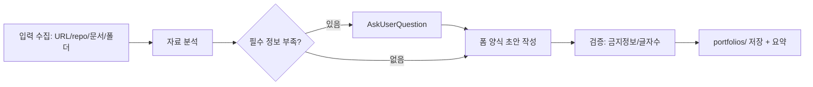

# wishket-portfolio — 위시켓 포트폴리오 등록 폼 작성

## 흐름



## 1단계: 입력 수집

사용자가 제시한 자료 유형별로:

- **사이트 URL**: WebFetch 또는 web_reader MCP로 메인·주요 페이지 내용 파악. 서비스 정체, 기능, 타깃 확인.
- **GitHub repo URL**: WebFetch로 repo 페이지(README) 확인. 추가로 `package.json` / `Cargo.toml` / `pubspec.yaml` / `requirements.txt` / `go.mod` 등 매니페스트 원시 URL을 WebFetch해 기술 스택 확정.
- **요구사항 문서 (PDF/PPT/DOCX/XLSX)**:
  - PDF: Read 도구로 직접 읽음.
  - PPTX: `unzip -p <file>.pptx 'ppt/slides/*.xml' | sed -e 's/<[^>]*>/ /g'`로 텍스트 추출.
  - DOCX: `unzip -p <file>.docx word/document.xml | sed -e 's/<[^>]*>/ /g'`.
  - XLSX: `unzip -p <file>.xlsx 'xl/sharedStrings.xml' | sed -e 's/<[^>]*>/ /g'`.
  - 추출 실패 시 사용자에게 텍스트 붙여넣기 요청.
- **프로젝트 폴더**: README, 매니페스트, 디렉터리 구조 위주로 탐색(전수조사 불필요). 주 기술·아키텍처·핵심 기능 파악.

여러 소스가 섞이면 교차 검증: 실제 사용 기술은 코드/매니페스트 우선, 비즈니스 맥락은 요구사항 문서·사이트 우선.

## 2단계: 필수 정보 확인

코드에서 유추 불가능한 필드는 지어내지 말고 AskUserQuestion으로 물은 뒤 반영:

- 참여 기간 (시작/종료 연월)
- 참여율 (%)
- 고객사 / 본인 역할
- 정량 성과 수치 (없으면 성과 항목에서 제외하거나 정성 서술로 대체)
- 업무 범위(카테고리) 및 분야 후보 중 최종 선택 (분야는 최대 3개)

유추 가능한 필드(제목, 기술, 상세, 배경, 핵심 기능, 진행 단계)는 초안을 먼저 만들고 사용자 수정을 받는다.

## 3단계: 초안 작성 규칙

**출력은 전부 일반 텍스트(마크다운 아님).** 각 필드 값에 `#`, `**`, `` ` ``, 표 문법 등 마크다운 기호 금지. 목록은 `-` 또는 `1)` 형식만.

- **포트폴리오 제목**: "무엇을 구축해 무슨 효과를 냈는가" 형식. 예시 톤: "LMS와 연동 AI 챗봇 구축으로 대응 시간 단축". 정량 지표가 있으면 포함.
- **업무 범위(카테고리) / 분야**: 분석 결과에서 후보 제안, 사용자가 확정. 분야 최대 3개.
- **관련 기술**: 쉼표 구분 (예: React, Node.js, AWS). 매니페스트에서 확인된 것만. 버전은 생략.
- **프로젝트 상세**: 배경, 과정, 기술적 이슈, 해결 방안 순으로 문단 구성. 정량 지표 우선 포함.
- **프로젝트 배경**: 1) 문제점 2) 목표 3) 주안점 구조(폼 예시 형식 준수).
- **성과 / 진행 단계 / 핵심 기능의 설명**: 각 최대 120자. 초과분은 작성 후 잘라내며 문장이 끊기지 않게 정리.
- **진행 단계**: 시간순. 단계명은 짧게(예: 기획, 설계, 개발, 테스트, 런칭), 설명에 산출물·범위.
- **핵심 기능**: 기능명 짧게, 설명은 동작 방식 1문장.

**금지 정보 검증 (마지막 폼 경고 준수)**: 이메일, 전화번호, 회사명, 회사 홈페이지 등 외부 연락 수단이 초안 어디에도 있으면 제거. 개인정보도 동일. 사용자가 제공한 고객사명은 "고객사" 필드에만 들어가고 상세 본문에는 넣지 않는다.

## 4단계: 출력

파일 저장: `~/.wishket-radar/portfolios/YYYY-MM-DD-<slug>.md` (디렉터리 없으면 생성).

포트폴리오는 특정 공고에 종속되지 않는 재사용 자산이므로 **파일명에 공고 ID를 넣지 않는다** (제안서와 반대). 대시보드에서는 "내 정보 > 포트폴리오" 탭에 프로필과 나란히 표시된다.

본문은 아래 양식 그대로:

```text
위시켓 포트폴리오 초안 — YYYY-MM-DD

[포트폴리오 제목]
{제목}

[업무 범위(카테고리)]
{카테고리}

[포트폴리오 분야] (최대 3개)
{분야1}, {분야2}

[관련 기술]
{기술1}, {기술2}, ...

[참여 기간]
시작: YYYY.MM
종료: YYYY.MM
참여율: NN%

[고객사 및 역할]
고객사: {고객사}
역할: {역할}
결과물 URL: {URL}

[프로젝트 상세]
{본문}

[프로젝트 배경]
1) 문제점
- ...
2) 프로젝트 목표
- ...
3) 주안점
- ...

[프로젝트 성과]
1. {성과명}
   {설명 120자 이내}
2. ...

[진행 단계]
1. {단계명} (YYYY.MM)
   {설명 120자 이내}
2. ...

[핵심 기능]
1. {기능명}
   {설명 120자 이내}
2. ...

[직접 등록 필요]
- 표지 이미지 480x480px
- 포트폴리오 이미지 (최대 10장, 가로 736px 권장, 파일당 8MB)
- 핵심 기능별 이미지 (기능당 최대 3장)
```

채팅에는 전문 대신 요약: 제목, 기술 스택, 핵심 기능 개수, 사용자 확인이 필요한 항목(추측 포함 필드), 저장 경로.

## 주의

- 성과 수치는 사용자 확인 없이 창작 금지. 요구사항 문서에 있더라도 "달성"이 아니라 "목표"면 목표로 표기.
- 참여 기간·참여율·고객사는 어떤 소스에도 없으면 반드시 질문.
- 이미지 등록은 자동화 불가. 초안 말미에 수동 등록 항목 안내.
