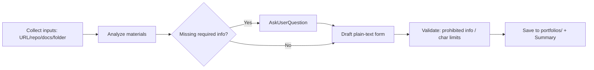

# wishket-portfolio — Wishket Portfolio Draft Generator

## Flow



## Step 1: Input Collection

Extract context by input type:

- **Live URL**: Fetch main pages via WebFetch or browser tools. Identify service purpose, key features, target audience.
- **GitHub Repository**: Fetch README and raw manifest files (`package.json`, `Cargo.toml`, `pubspec.yaml`, `requirements.txt`, `go.mod`) to confirm tech stack.
- **Requirement Documents (PDF/PPT/DOCX/XLSX)**:
  - PDF: Read directly.
  - PPTX: `unzip -p <file>.pptx 'ppt/slides/*.xml' | sed -e 's/<[^>]*>/ /g'`.
  - DOCX: `unzip -p <file>.docx word/document.xml | sed -e 's/<[^>]*>/ /g'`.
  - XLSX: `unzip -p <file>.xlsx 'xl/sharedStrings.xml' | sed -e 's/<[^>]*>/ /g'`.
  - Fallback: Request text copy-paste from user if extraction fails.
- **Local Project Folder**: Inspect README, manifests, and directory tree. Identify core architecture and features.

Cross-validate multi-source inputs: Code/manifests take precedence for tech stack; requirement docs/websites take precedence for business context.

## Step 2: Verify Required Information

Never invent fields that cannot be inferred from code. Inquire via `AskUserQuestion`:

- Participation period (Start / End YYYY.MM)
- Contribution rate (%)
- Client name / User role
- Quantitative metrics (if none, omit from accomplishments or use qualitative phrasing)
- Category & Domain field selection (up to 3 fields)

Inferrable fields (Title, Tech, Details, Background, Core Features, Phases) should be drafted first for user review.

## Step 3: Drafting Rules

**Output must be Plain Text (NOT Markdown).** Do not include `#`, `**`, `` ` ``, or markdown tables. Use `-` or `1)` for lists.

- **Portfolio Title**: Format as "What was built and what outcome was achieved" (e.g., "LMS 연동 AI 챗봇 구축으로 고객 대응 시간 단축"). Include metrics if present.
- **Category / Domain**: Propose candidates; user confirms. Maximum 3 domains.
- **Related Tech**: Comma-separated (e.g., React, Node.js, AWS). Only confirmed manifest technologies, omitting versions.
- **Project Details**: Must match the Wishket form's four fixed subfields, in order:
  1) **포트폴리오 소개**: one line covering the service category (커머스, AI, SaaS 등) and the main target (주부, 청소년, 소상공인 등). e.g. "주부들을 위한 생활용품 커머스 개발".
  2) **작업 범위**: participation scope plus 지원환경. Scope example: "화면 설계, UI/UX 디자인, 서버 구축, Front-end 개발, 관리자 페이지 개발". 지원환경 example: "반응형 웹, Android, iOS" — write it as a second line, not merged into the scope list.
  3) **주요 업무**: key features and pages of the service as a comma-separated list. e.g. "회원등급제 기능, 숙소 추천 로직 구성, GPS 기반 숙소 리스트, 실시간 예약 및 결제 페이지".
  4) **주안점**: what the build prioritized. e.g. "개인 정보에 대한 보안, 트렌디한 디자인".

  Narrative analysis (challenges, solutions, process) feeds the phrasing of 3) and 4) — do not emit free-form paragraphs under 프로젝트 상세.
- **Project Background**: 1) Problem 2) Goal 3) Key Focus.
- **Accomplishments / Phases / Feature Descriptions**: Max 120 Korean characters each. Trim cleanly without truncating sentences mid-thought.
- **Phases**: Chronological order with concise phase names (e.g., 기획, 설계, 개발, 테스트, 런칭) and deliverables in description.
- **Core Features**: Brief feature name + 1-sentence explanation of behavior.

**Prohibited Information Check (Wishket compliance)**: Strip all external contact information (emails, phone numbers, external company websites, personal info). Client names appear only in the Client field, not inside body text.

## Step 4: Output

Save path: `~/.wishket-radar/portfolios/YYYY-MM-DD-<slug>.md` (create directory if missing).

Portfolios are reusable assets not tied to specific project IDs, so **do not include project IDs in the filename** (unlike proposals).

Content format:

```text
위시켓 포트폴리오 초안 — YYYY-MM-DD

[포트폴리오 제목]
{Title}

[업무 범위(카테고리)]
{Category}

[포트폴리오 분야] (최대 3개)
{Field 1}, {Field 2}

[관련 기술]
{Tech 1}, {Tech 2}, ...

[참여 기간]
시작: YYYY.MM
종료: YYYY.MM
참여율: NN%

[고객사 및 역할]
고객사: {Client}
역할: {Role}
결과물 URL: {URL}

[프로젝트 상세]
1) 포트폴리오 소개
{서비스 카테고리 + 메인 타깃 한 줄. 예) 주부들을 위한 생활용품 커머스 개발}
2) 작업 범위
{참여 범위. 예) 화면 설계, UI/UX 디자인, 서버 구축, Front-end 개발, 관리자 페이지 개발}
{지원환경. 예) 반응형 웹, Android, iOS}
3) 주요 업무
{주요 기능·페이지. 예) 회원등급제 기능, 숙소 추천 로직 구성, GPS 기반 숙소 리스트, 실시간 예약 및 결제 페이지}
4) 주안점
{중점 사항. 예) 개인 정보에 대한 보안, 트렌디한 디자인}

[프로젝트 배경]
1) 문제점
- ...
2) 프로젝트 목표
- ...

[프로젝트 성과]
1. {Achievement Name}
   {Description <= 120 chars}
2. ...

[진행 단계]
1. {Phase Name} (YYYY.MM)
   {Description <= 120 chars}
2. ...

[핵심 기능]
1. {Feature Name}
   {Description <= 120 chars}
2. ...

[직접 등록 필요]
- 표지 이미지 480x480px
- 포트폴리오 이미지 (최대 10장, 가로 736px 권장, 파일당 8MB)
- 핵심 기능별 이미지 (기능당 최대 3장)
```

Chat output: Provide summary only (Title, Tech Stack, Feature count, Items requiring confirmation, File path).

## Caution

- Do not invent accomplishment metrics without user confirmation. If requirement docs state targets, mark them as "목표" rather than "달성".
- If participation period, contribution rate, or client name is missing from every source, ask before saving.
- Image assets cannot be automated; note manual upload requirements at the bottom of the draft.
