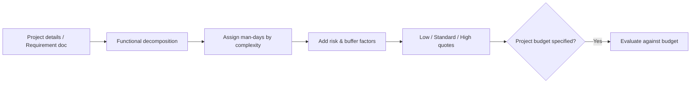

# wishket-quote — Project Cost & Man-day Estimation

## Premise

This skill uses **functional decomposition + heuristic effort coefficients** to establish an estimation baseline. It is not an absolute market rate. Always label results with "Heuristic estimate; user adjustment required".

## Flow

## Step 1: Input

- Project ID/URL: Fetch via `get_project`. Check `state.json` cache `seen[<id>].description` first if available.
- Requirement Document (PDF/PPT/DOCX): Extract text following `wishket-portfolio` extraction methods.
- Fallback: Ask user for verbal/bullet list of features.

## Step 2: Functional Decomposition

Break down requirements into actionable units. Tag each feature with role components (UI, Backend, Infra, Design, Integration). Explicitly mark out-of-scope items (e.g., Maintenance, Marketing).

## Step 3: Man-day Allocation (Heuristic)

Classify man-days per feature into 3 complexity levels (single developer basis):

| Complexity | Criteria | Man-days |
|---|---|---|
| Simple | Single CRUD, reusing existing pattern | 1-2 days |
| Medium | New screen + API, standard integrations (PG, SSO) | 3-5 days |
| Complex | Algorithms, RAG pipelines, settlement engines, performance tuning | 7-15 days |

Adjustment Multipliers:
- Ambiguous specs or heavy "to be decided" items: +30%.
- Legacy codebase analysis required: +15%.
- External 3rd party coordination dependencies: +15%.
- Testing, deployment, buffer: +20% base on development subtotal.

## Step 4: Cost Calculation

- Ask the user for their daily rate in 만원 per man-day. Do not assume a default rate. If unknown, report man-days only and ask for the rate before converting to KRW. Quote KRW = man-days × (만원/인일) × 10,000.
- 3 Tiers: Lower bound (excluding buffer), Standard (default), Upper bound (all risk buffers included).
- Comparison with posting budget: Within budget / Borderline (80-120% of budget) / Exceeded (suggest scope cuts).
- If budget exceeded, offer feature prioritization cuts.

## Step 5: Output

- Plain text table (compatible with Wishket forms and chat): Feature | Complexity | Man-days.
- Total man-days, 3 tier estimates, budget comparison, and stated assumptions (daily rate, excluded items).
- If proceeding to `wishket-apply`, use standard estimate as temporary budget figure.

## Caution

- Provide a 1-line rationale for each feature's man-day allocation so the user can adjust easily.
- If the user provides empirical experience figures (e.g., "PG integration takes 2 days for me"), prioritize their input and update the coefficient table for this run.
