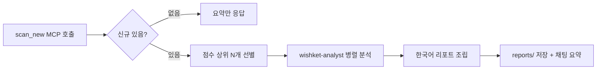

# wishket-scout — 위시켓 프로젝트 스카우트

## 흐름



## 1단계: 스캔

MCP 도구 `wishket` 서버의 `scan_new` 호출. 인자 없이 호출하면 기본 필터(전달받은 인자가 있으면 그것 사용):

```
scan_new(category="development", form_factors="web,pc,android,ios", max_pages=3)
```

- 사용자가 키워드를 지정했으면 `keyword` 추가.
- 첫 실행(`baseline: true`)이면 모든 항목이 신규인 것이 정상. 리포트에 "베이스라인 스캔" 표시.
- `new_count == 0`이면: 마지막 스캔 시각(`~/.wishket-radar/state.json`의 `last_scan`)과 함께 "신규 없음"만 응답하고 종료.
- `total_matching_filter` 대비 조회 수가 현저히 적으면(30건 조회 제한) 리포트에 "상위 N페이지만 조회함" 명시.

## 2단계: 후보 선별

응답의 `new` 배열을 `match.score` 내림차순(이미 정렬됨) 기준으로:

- **score >= 40** 또는 상위 5개 중 큰 쪽을 분석 대상으로.
- score가 낮아도 제목에 명시적 키워드(예: rust, flutter, llm)가 있으면 포함.
- 분석 대상은 최대 5개. 나머지는 리포트 말미에 표로 간단 나열.

## 3단계: 상세 분석 (병렬)

각 후보에 대해 `get_project(id)`로 상세(JSON-LD 전체 설명 포함)를 가져운 뒤, **Agent 도구로 `wishket-analyst` 서브에이전트를 후보별로 동시 디스패치** (한 메시지에 여러 Agent 호출).

- 서브에이전트 프롬프트: get_project 결과 JSON 전체 + 사용자 프로필 요약(아래 기준값).
- 프로필 요약 기준: `profile.yaml` 내용. 모르면 이 기본값 사용 — "Rust 주력, Svelte+TS, PostgreSQL, Tauri, Flutter, AWS, AI/임베딩(Rust 선호/Python 가능), 원격 우선/서울 출근 가능".

## 4단계: 리포트

리포트 파일: `~/.wishket-radar/reports/YYYY-MM-DD-HHmm.md` (디렉터리 없으면 생성, 한국 시각 기준 파일명).

템플릿:

```markdown
# 위시켓 스캔 리포트 — YYYY-MM-DD HH:mm

신규 N건 (전체 M건 중 조회 K건) · 필터: development / web,pc,android,ios
> 베이스라인 스캔 (첫 실행) 또는 마지막 스캔: {last_scan}

## 분석 대상 (적합도 순)

### 1. [A] {제목}
- URL: {url} · {budget} · {duration} · {role}/{level} · {location}
- 키워드 매칭: {score}점 (matched: ..., missing: ...)
- 적합도 판단: {analyst 서술}
- 주의점: {analyst 서술}
- 제안 방향: {analyst 서술 1-2줄}

(후보마다 반복)

## 그 외 신규 (미분석)

| 제목 | 스코어 | 지원자 | 댓글 | 좋아요 | 예산 | 마감 |
|---|---|---|---|---|---|---|
```

적합도 등급은 analyst 판정(A/B/C) 사용. 등급 기준: A=핵심 스택 직접 매칭+조건 합리적, B=부분 매칭 또는 조건 불확실, C=스택 편차 큼.

## 5단계: 채팅 요약

리포트 전문 대신 요약 응답:

- 신규 N건, A/B/C 등급 분포
- A등급 프로젝트 제목+한줄 이유 (있으면)
- 리포트 파일 경로
- 마감 임박(마감 1주 이내) 항목 강조

## 유지

- 스캔 기준 갱신: 사용자가 "매칭 기준 바꿔줘" 하면 `profile.yaml` 편집 (`/wishket-profile` 커맨드 안내).
- 캐시 리셋: `reset_cache` MCP 도구. 다음 스캔이 베이스라인이 됨.
- 필터 확인: `list_filters` 도구. 검증된 키(c/ff/page/s) 외에는 raw로만 전달.
