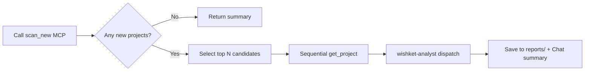

# wishket-scout — Wishket Project Scout & Analysis

## Flow



## Step 1: Scan

Call `scan_new` on the `wishket` MCP server. Default parameters (`category=development`, `form_factors=web,pc,android,ios`, `max_pages=3`) apply automatically unless specified by the user.

- If the user specified keywords, include `keyword`.
- On initial run (`baseline: true`), all fetched projects are new; indicate "Baseline Scan" in the report.
- If `new_count == 0`: return "No new projects" along with the last scan time (`last_scan` in `~/.wishket-radar/state.json`) and exit.
- If `total_matching_filter` significantly exceeds retrieved items (30 items limit), note in the report: "Fetched top N pages only".

## Step 2: Candidate Selection

From the response `new` array, sorted by `match.score` descending:

- Select candidates with **score >= 40** or the top 5, whichever is larger.
- Include projects with explicit keywords in the title (e.g., Rust, Flutter, LLM) even if the score is lower.
- Limit deep analysis to at most 5 items. List remaining items in a brief table at the end of the report.

## Step 3: Detailed Analysis

For each candidate, fetch details (including full JSON-LD description) **sequentially** using `get_project(id)`. Do NOT call `get_project` in parallel to respect the 5-second `Crawl-delay` robots.txt policy. After collecting details, `wishket-analyst` subagents may be dispatched in parallel per candidate.

- Subagent Prompt: Full JSON result of `get_project` + user profile summary.
- User profile summary: Read `~/.wishket-radar/profile.yaml` (or `WISHKET_PROFILE`). If the file does not exist, do not fabricate a stack; pass "No profile configured" and suggest running `wishket-onboard`.

## Step 4: Report Generation

Save the report to `~/.wishket-radar/reports/YYYY-MM-DD-HHmm.md` (create directory if missing, timestamp in KST).

Template format:

```markdown
# 위시켓 스캔 리포트 — YYYY-MM-DD HH:mm

신규 N건 (전체 M건 중 조회 K건) · 필터: development / web,pc,android,ios
> 베이스라인 스캔 (첫 실행) 또는 마지막 스캔: {last_scan}

## 분석 대상 (적합도 순)

### 1. [A] {제목}
- URL: {url} · {budget} · {duration} · {role}/{level} · {location}
- 키워드 매칭: {score}점 (matched: ..., missing: ...)
- AI 평가: {analyst 점수}점 · 모델: {model}
- 적합도 판단: {analyst output}
- 주의점: {analyst output}
- 제안 방향: {analyst output 1-2 lines}

(Repeat for each candidate)

## 그 외 신규 (미분석)

| 제목 | 스코어 | 지원자 | 댓글 | 좋아요 | 예산 | 마감 |
|---|---|---|---|---|---|---|
```

Fit grades use the analyst rating (A/B/C): A = direct core stack match + reasonable terms, B = partial match or uncertain terms, C = large stack mismatch.

The `AI 평가` line records the analyst's numeric score and the model that produced it. `wishket-analyst` runs with `model: inherit`, so the dispatcher stamps the model field with its own session model identifier (the model name stated in the session context, e.g. `claude-opus-5`) — the analyst itself does not report the model.

## Step 5: Chat Summary

Provide a concise summary instead of the entire report:

- Total new items count and A/B/C grade distribution.
- Grade A project titles and one-line rationale (if any).
- Path to the saved report file.
- Highlight imminent deadlines (closing within 1 week).

## Report and Inbox Integration

The web UI dashboard parses `reports/*.md` to attach fit grade (A/B/C), risks, and proposal advice directly to Inbox cards. Maintain the exact format `### N. [A] Title` heading and `- URL:` line for seamless parser linkage.

## Maintenance

- Updating scan criteria: If the user requests updating matching criteria, edit `profile.yaml` via `wishket-profile`.
- Tracking analyzed projects: Register them to "Interested" via `wishket-pipeline` or triage them in the dashboard Inbox.
- Cache reset: Use the `reset_cache` MCP tool (the next scan will become a baseline).
- Check filters: Use the `list_filters` tool. Pass only validated keys (`c` / `ff` / `page` / `s`) as structured arguments; everything else as `raw`.
